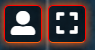
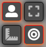
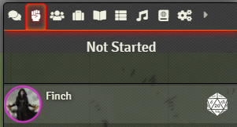
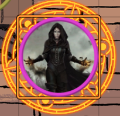

# Getting started

Go to the link provided in Discord (not shared here for security reasons). You should see a login page like this:

Select your character and click "Join Game Session". There is no access key for players.

Once you log in you will likely see a pop-up indicating that the Beyond20 extension is not automatically loaded. In the "addons" area of your browser (to the right of the address bar in Chrome), click the icon that looks like a red d20 with a white `B` inside of it , and the popup should go away. Click again in the main window to dismiss the Beyond20 pop-up. You are now connected to D&D Beyond.

> Note: In my browser the Beyond20 extension icon was hidden by default. To show it, click the puzzle icon on the right of the extensions area, then select the pin next to the Beyond20 extension

The overall user interface looks like this (with annotations)

You can toggle most of the UI off or on by clicking on the anvil in the upper left.

## Basic controls
* Pan the map by holding the right mouse button and dragging
  - On a Mac without a mouse use the ⌘ button and arrow keys
* Zoom with the mouse wheel
* Select your token with left-click, when the Player --> selection control is checked 
* Move the selected token with the arrow keys
* Double-click your token to open your character sheet
* Right-click your token to see options
* Target another token by choosing the Player --> target control  and left-clicking the token you wish to target. 4 triangles should appear around it.
* Make rolls using the HUD. This will be covered in more detail later

## Importing & Updating your character sheet

### Importing

Assuming your character sheet is on D&D Beyond and you are using the Beyond20 browser extension:

1. Double-click your token to open the Foundry character sheet
2. Click the `B` button to the left of your character's name .
3. In the URL field, paste the link to your character sheet from D&D Beyond
4. Close this window
5. Hold `Alt` and left-click the `B` button again. This should open a window with a bunch of JSON data
6. Copy all of the JSON data and close the window
7. Left-click the `B` button again
8. Paste the JSON data you copied into the JSON field
9. The import window should close and your character stats will be updated

### Updating

#### If leveling up

Start from step 5 above for importing, however before you paste the JSON data in, uncheck everything except "Classes", "Features", and "Spells"

#### If adding new gear or inventory

Start from step 5 above for importing, however before you paste the JSON data in, uncheck "Classes", "Features", and "Spells" and check "Import new items only." under "Update configuration"

#### If modifying gear

Similar to when adding new gear, but you will leave "Import new items only" unchecked. You may need to reassign the icon for this gear.

## Combat

Join combat by selecting "Toggle Combat State" from the "Utility" menu in the HUD. 

Next, select the combat menu and click the d20 icon to the right of your character to roll initiative.

> Note: It may be convenient to pop-out the combat tracker by right-clicking its menu icon (the fist)

When it is your turn, a message will be sent to the chat and your token will have an orange rune displayed around it.

Take your actions (making sure to target when appropriate). When done, click the "End Turn" button at the bottom of the combat window.

## Scenes

The scenes available to you are shown in a bar across the top, just to the right of the anvil. The small colored circle with the first letter of your player name indicates which scene you are currently on. Clicking on one of the scene boxes will take you to that scene.

> Note: you must also have "visibility" in the new scene, either via a token or scene settings. This is controlled by the GM

## Controls
The top-level controls shown just below the anvil and their sub-controls are, from top to bottom:
* Player
  - Select
  - Target
  - Measure
  - X-card (safety word)
* Measurement
  - Circle
  - Cone
  - Rectangle
  - Ray
* Drawing
  - Select
  - Rectangle
  - Circle
  - Polygon
  - Freehand
  - Text
  - Configuration
* Landmarks
  - Select
  - Toggle
* Dice roller

## Menus

The top right menus, in order, are:
* Chat
* Combat
* Actors
* Items
* Journal
* Tables
* Playlists
* Compendia
* Settings