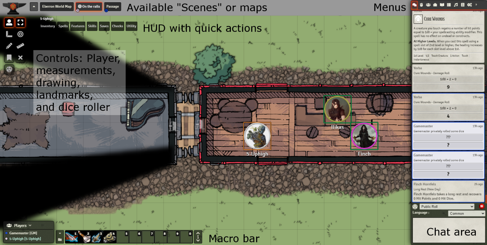

# Getting started

Go to the link provided in Discord (not shared here for security reasons). You should see a login page like this:

Select your character and click "Join Game Session". There is no access key for players.

Once you log in you will likely see a pop-up indicating that the Beyond20 extension is not automatically loaded. In the "addons" area of your browser (to the right of the address bar in Chrome), click the icon that looks like a red d20 with a white `B` inside of it, and the popup should go away. Click again in the main window to dismiss the Beyond20 pop-up. You are now connected to D&D Beyond.

The overall user interface looks like this (with annotations)

